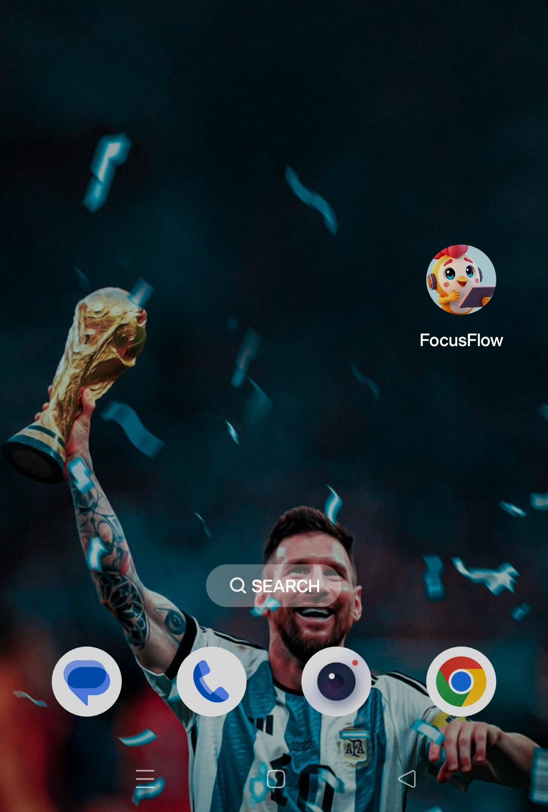
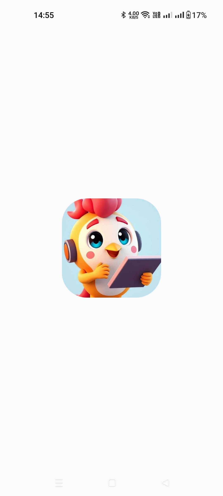
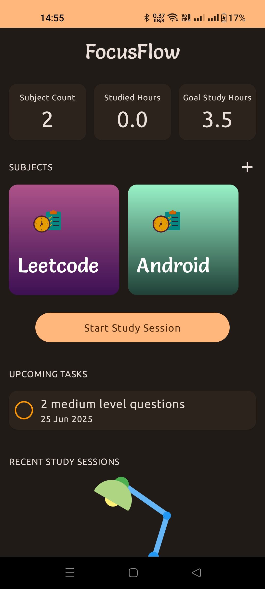
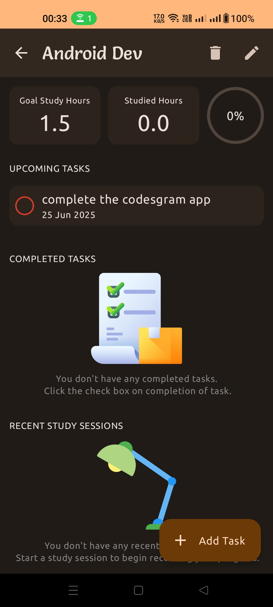
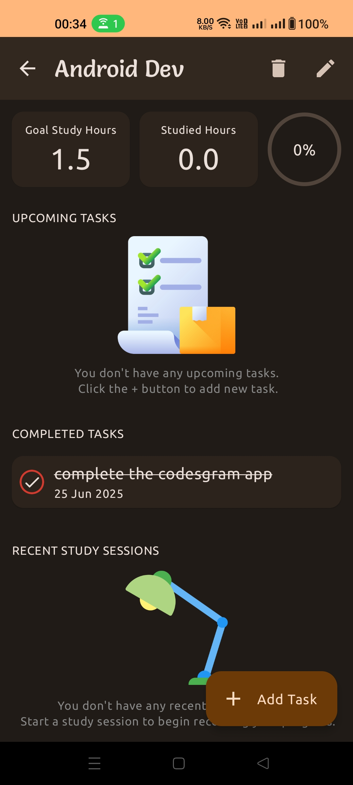
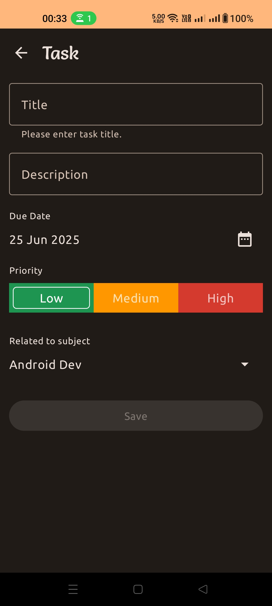
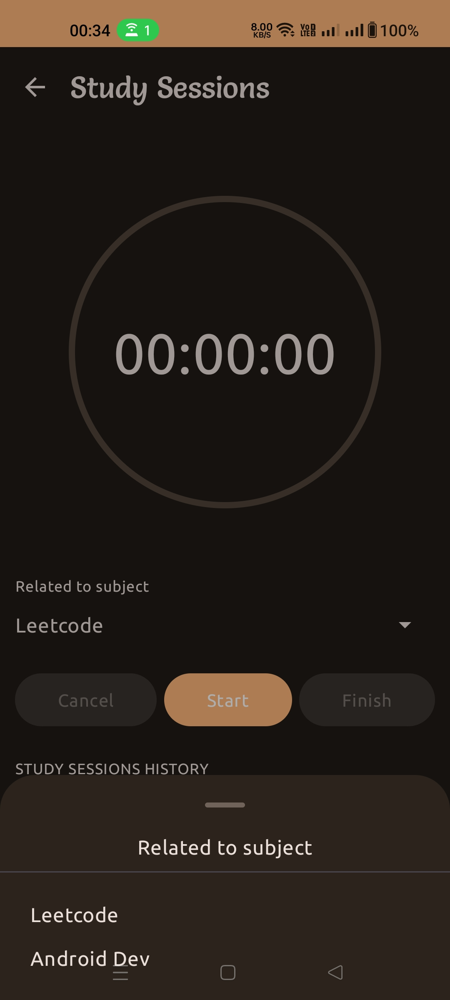
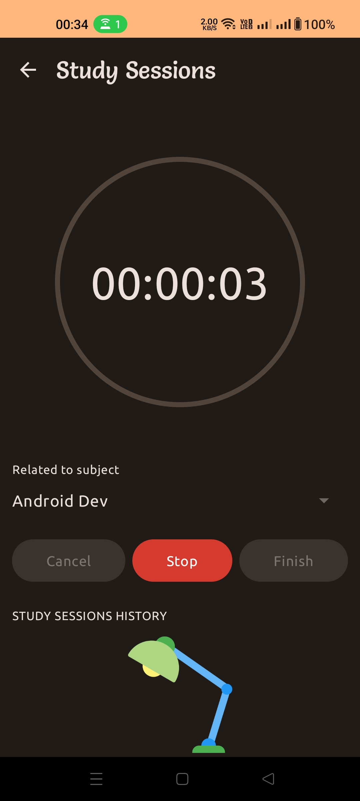
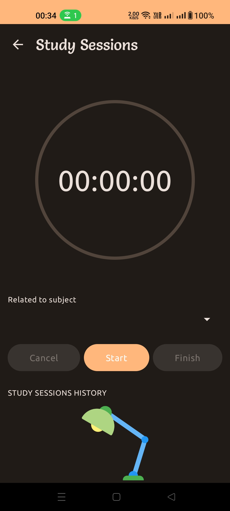
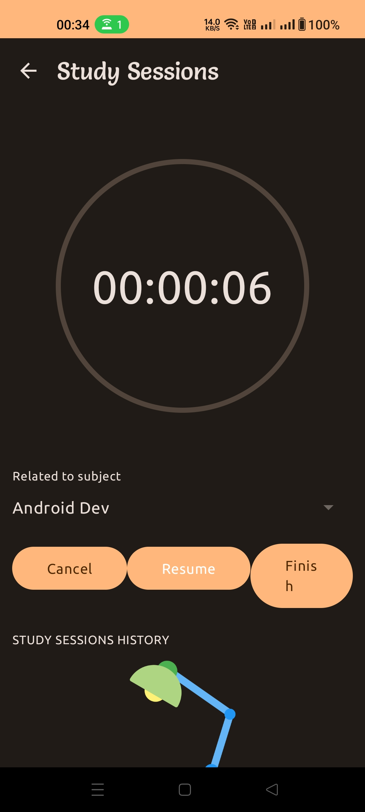

# 📚 FocusFlow

[](https://developer.android.com/) [](https://kotlinlang.org/) [](https://developer.android.com/jetpack/compose)

> **Ace your studies with organization, focus, and style!**

---

## App download link
[Google Drive](https://drive.google.com/file/d/1iG82oK2qMPVZ1-M4kg0OLgH6gZxKvsiy/view?usp=drivesdk)

---

## ✨ Overview

**FocusFlow** is your all-in-one study companion for Android. Effortlessly manage your subjects, track study sessions, and stay on top of your academic goals with a beautiful, intuitive interface. Whether you're a student, exam aspirant, or lifelong learner, StudySmart helps you study smarter, not harder.

---

## 🚀 Features

- 🏠 **Dashboard at a Glance:**
  - Instantly see your total subjects, studied hours, and goals.
- 📚 **Subject Management:**
  - Add, edit, and color-code subjects. Set personalized study hour goals.
- ✅ **Task Tracking:**
  - Organize tasks by subject. Mark tasks as complete and view upcoming or finished work.
- ⏱️ **Study Sessions:**
  - Start, pause, and review your study sessions. Visualize your progress over time.
- 📈 **Progress Visualization:**
  - See your achievements and how close you are to your goals.
- 🔔 **Reminders & Notifications:**
  - (If enabled) Get timely nudges to keep you on track.
- 💾 **Offline & Secure:**
  - All your data is stored locally using Room Database.
- 🎨 **Modern Material 3 UI:**
  - Enjoy a smooth, responsive, and visually appealing experience.

---

## 🖼️ Screenshots

<p align="center">
  
  
  
  
  
  
  
  
  
  
  
  <!-- Add more screenshots as needed -->
</p>

<!--
Add screenshots below to showcase the app:


-->

---

## 🏗️ Project Structure

```
app/
  ├── src/
  │   ├── main/
  │   │   ├── java/com/example/studysmart/   # App source code
  │   │   ├── res/                           # Resources (images, layouts, values)
  │   ├── test/                              # Unit tests
  │   └── androidTest/                       # Instrumented tests
  ├── build.gradle.kts
  └── proguard-rules.pro
```

---

## 🧰 Tech Stack

- **Kotlin**
- **Jetpack Compose** (UI)
- **Room Database** (Persistence)
- **Dagger Hilt** (Dependency Injection)
- **Material 3** (Design)
- **Android Architecture Components** (ViewModel, StateFlow)
- **Gradle** (Build System)


---

> _Made with ❤️ for learners and achievers. Contact me- [shivnanip815@gmail.com]_
